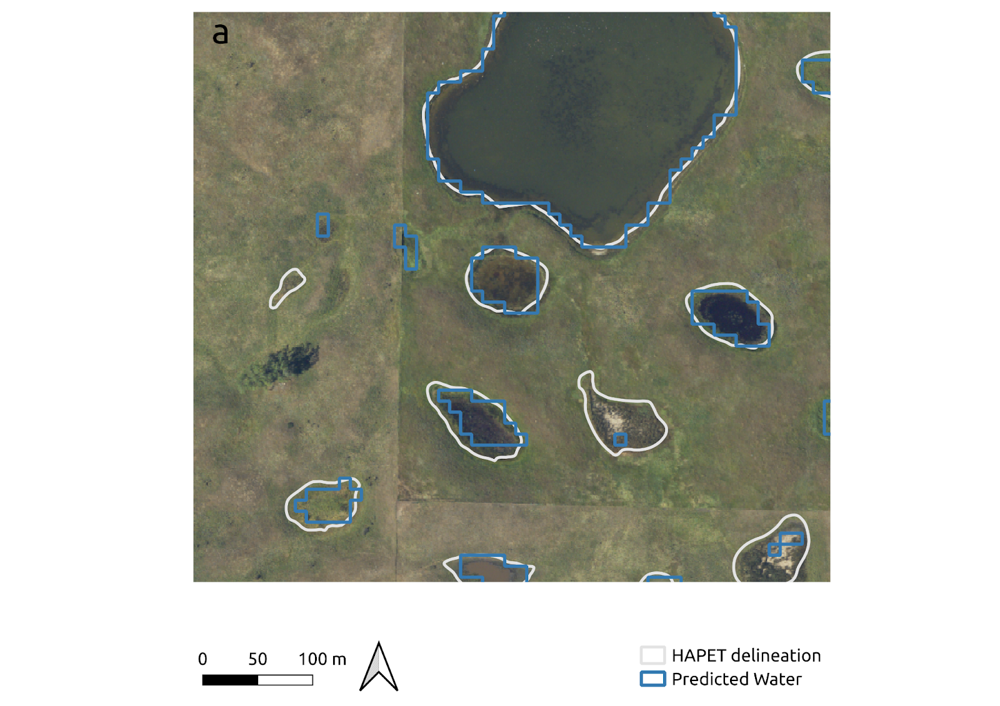

# PPR Pond Mapper

In this project, I use remote sensing, machine learning, and open science practices to map terrestrial wetlands in the Great Plains region at a high level of detail. This work is funded by the USFWS and NASA, in an effort to better inform waterfowl conservation. Learn more about it [here](https://www.landscapemodeling.net/water.html). 

  
