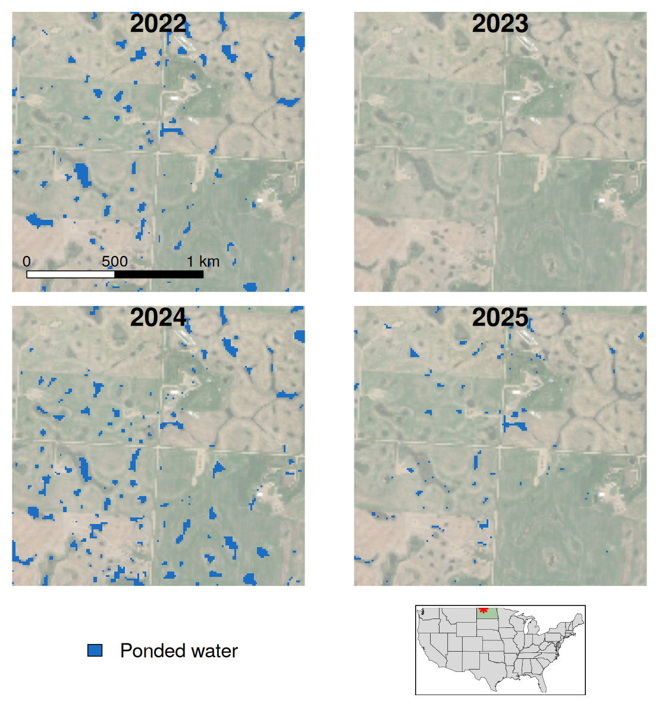
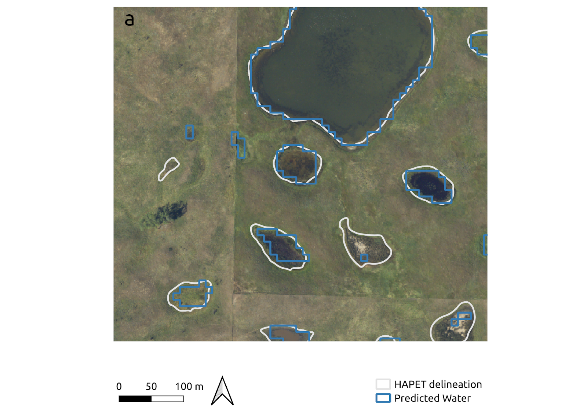
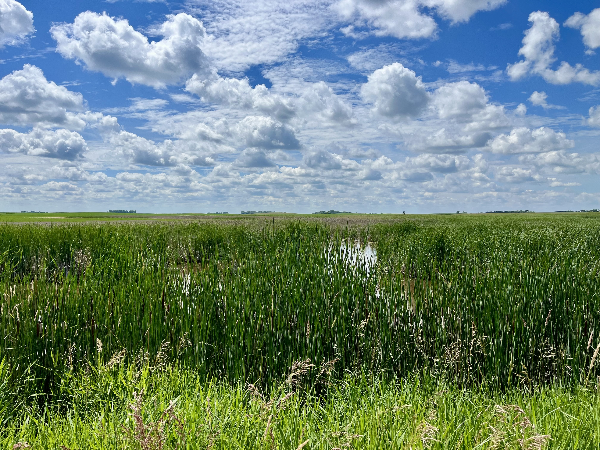

# Prairie Pond Mapper

I use remote sensing, AI modeling, and open science practices to map prairie potholes - inland wetlands that dot the Northern Great Plains. The tool I built is called the Prairie Pond Mapper ("PPM"), and is available in Google Earth Engine. Check it out [here](https://code.earthengine.google.com/2f358b4afc3a98f4a21105bf6b5d68dc) and find the documentation [here](https://github.com/maggiechurch741/PPR_Pond_Mapper).

This project is funded by NASA and done in collaboration with the USFWS and Ducks Unlimited to better inform waterfowl conservation.

:::: {.plot30-timelapse-player style="max-width: 400px; margin: 1.5em auto;"}


::: {style="display:flex; align-items:center; gap:0.75em; margin-top:0.6em;"}
<button id="plot30-play" aria-label="Play" style="padding:0.25em 0.75em; cursor:pointer; font-size:1em;">

▶

</button>

<input id="plot30-slider" type="range" min="0" max="10" value="0" step="1" style="flex:1;"> [April 1-15]{#plot30-label style="min-width:7.5em; font-size:0.9em; color:#555; text-align:right;"}
:::

<figcaption>Ponded water (blue) across the 2022-2025 growing seasons. Drag the slider or press play to step through each \~2-week period.</figcaption>
::::

Prairie potholes generally fill with snowmelt and rain, and many dry by fall. But notice how these patterns change from year-to-year.

::: {style="max-width: 500px; margin: 1.5em auto;"}

:::

```{=html}
<script>
(function() {
  var labels = ["April 1-15","April 16-30","May 1-15","May 16-31","June 1-15","June 16-30","July 1-15","July 16-31","August 1-15","August 16-31","September 1-15"];
  var frameCount = labels.length;
  var img = document.getElementById('plot30-frame');
  var slider = document.getElementById('plot30-slider');
  var label = document.getElementById('plot30-label');
  var playBtn = document.getElementById('plot30-play');
  var playing = false;
  var timer = null;

  function frameSrc(i) {
    var n = i + 1;
    var padded = n < 10 ? '0' + n : '' + n;
    return 'media/plot30_panels/panel_' + padded + '.png';
  }

  function showFrame(i) {
    img.src = frameSrc(i);
    label.textContent = labels[i];
    slider.value = i;
  }

  function stepFrame() {
    var next = (parseInt(slider.value, 10) + 1) % frameCount;
    showFrame(next);
  }

  function stopPlaying() {
    playing = false;
    playBtn.innerHTML = '&#9654;';
    playBtn.setAttribute('aria-label', 'Play');
    if (timer) { clearInterval(timer); timer = null; }
  }

  function startPlaying() {
    playing = true;
    playBtn.innerHTML = '&#10074;&#10074;';
    playBtn.setAttribute('aria-label', 'Pause');
    timer = setInterval(stepFrame, 700);
  }

  slider.addEventListener('input', function() {
    stopPlaying();
    showFrame(parseInt(slider.value, 10));
  });

  playBtn.addEventListener('click', function() {
    if (playing) { stopPlaying(); } else { startPlaying(); }
  });

  for (var i = 0; i < frameCount; i++) {
    var preload = new Image();
    preload.src = frameSrc(i);
  }

  showFrame(0);
})();
</script>
```

The PPM achieved an omission error of 28% and commission error of 15% when tested in areas and time periods it had never seen before. Notably, the PPM detected 71% of ponds, compared to 34–53% for other models (Global Surface Water, Dynamic Surface Water Extent, Dynamic World).

I’m excited to see how we can keep getting better at finding and understanding these underrepresented, easy-to-miss wetlands!


